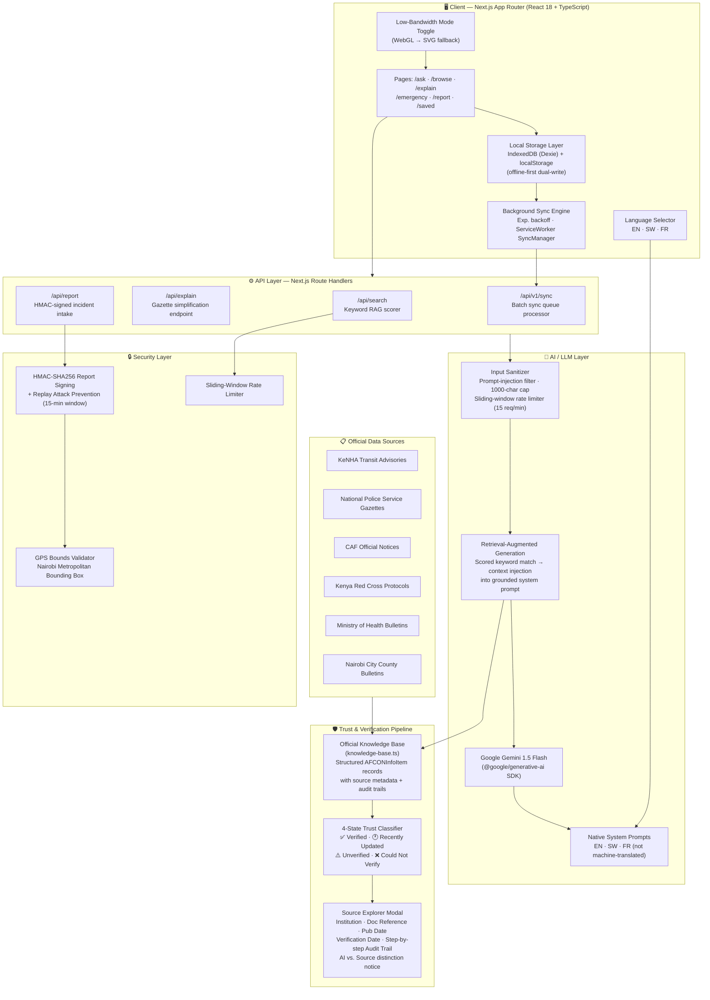

# 🏟️ Nairobi - Trusted AFCON 2027 Civic Intelligence

> **Verified, multilingual civic guidance for fans, residents, and visitors navigating AFCON 2027 in Nairobi — powered by AI grounded in official Kenyan public authority sources.**

[](https://andela.com)
[]()
[]()
[](https://nextjs.org)
[](https://ai.google.dev)
[](./LICENSE)

---  

## 📌 The Problem

When AFCON 2027 arrives in Nairobi, hundreds of thousands of fans - local Kenyans, East African supporters, and international visitors - will be navigating a city-wide civic event with unprecedented complexity: road closures, stadium entry rules, emergency contacts, transport corridors, health advisories, and public safety protocols.

The current information ecosystem is dangerously fragmented:

- Official notices live buried in government gazette PDFs, institutional portals, and police press releases.
- Rumour and misinformation spread rapidly on WhatsApp and social media.
- No single, plain-language, **verified** source answers the question: *"Is it safe to drive to Talanta today? Is public transport free? What do I do in a medical emergency at the stadium?"*

For users with limited data, low-end devices, or low literacy in legalese, this information gap becomes a **safety gap**.

---

## 🎯 Track & Target Users

**Track:** Safety, Reporting & Protection *(also addresses Transparency & Accountability)*

| User Group | Core Need |
|:---|:---|
| Local Nairobi residents | Real-time, verified transport & road closure information |
| Match-day spectators | Ticket rules, entry gates, shuttle routes, in-stadium protocols |
| International fans & tourists | Embassy contacts, translated safety advisories, emergency hotlines |
| Journalists & civic monitors | Traceable, source-attributed civic facts |
| Persons with disabilities | Accessible guidance on stadium facilities, accessible transport |

---

## ✨ Why This Is Unique

Most civic information platforms are either **news aggregators** (they scrape and republish without verification) or **government portals** (authoritative but inaccessible in format and language). Nairobi bridges that gap with an architecture that is rare in the African civic-tech space:

**Every answer carries a verifiable paper trail.** Rather than asking an AI to "know" the answer, Nairobi uses a structured **Retrieval-Augmented Generation (RAG)** pipeline grounded exclusively in accredited Kenyan public authority documents - KeNHA transit advisories, National Police Service gazettes, CAF official notices, Kenya Red Cross protocols, and Nairobi City County bulletins. Each answer card displays the issuing institution, official document reference number, publication date, last-verification date, and a timestamped audit trail - not just a URL.

Crucially, the platform distinguishes between **four trust states** (Verified ✅, Recently Updated 🕐, Unverified ⚠️, Could Not Verify ❌) surfaced through colour-coded badges and an expandable **Source Explorer Modal** - making the confidence level of every fact legible at a glance to any user, including those with limited civic literacy. This *trust infrastructure layer* is what no competitor has built at this granularity for an African tournament context.

---

## ⚙️ Key Features & How It Works

### The FIND → UNDERSTAND → VERIFY → ACT Loop

```
User Question  →  RAG Context Retrieval  →  Gemini AI Generation  →  Trust-Badged Answer Card  →  Actionable Next Steps
```

| Feature | Description |
|:---|:---|
| **Ask AI** (`/ask`) | Natural language Q&A. Gemini 1.5 Flash is grounded via a scored keyword-match retrieval layer across the official AFCON knowledge base. Returns structured Answer Cards with source attribution, not freeform text. |
| **Browse** (`/browse`) | Category-filtered information explorer. Filter by trust status (Verified / Updated / Unverified), sort by recency, full-text search, and expandable detail modals with complete source lineage. |
| **Explain This** (`/explain`) | Paste any government gazette text or complex notice → AI simplifies it into plain-language bullet points with next-step actions. Designed for low civic-literacy users. |
| **Emergency Center** (`/emergency`) | One-tap direct-dial for 999, 112, Kenya Red Cross 1199, and the AFCON Fan Safety Operations Centre. Includes stadium medical triage locator. No login, no friction. |
| **Report an Issue** (`/report`) | Low-friction civic incident reporting with HMAC-SHA256 signed payloads, GPS metadata validation, and immediate emergency intercept for life-safety situations. |
| **Saved Answers** (`/saved`) | Privacy-first, zero-account offline bookmark set using IndexedDB + localStorage. No user tracking. Works offline. |
| **How It Works** (`/how-it-works`) | Full transparency: 4-step trust cycle, badge criteria legend, sources directory, and scalability roadmap. |
| **Trust Badge System** | Every information card carries a colour-coded badge: Forest Emerald (✅ Verified), Cobalt Sky (🕐 Recently Updated), Ochre Amber (⚠️ Unverified), Brick Red (❌ Could Not Verify). Clicking opens the Source Explorer Modal. |
| **Low-Bandwidth Mode** | Manual toggle + automatic detection replaces the Three.js WebGL hero with an ultra-lightweight animated SVG medallion. Reduces initial payload by ~90%. |
| **Trilingual Interface** | Full UI and AI responses available in **English**, **Kiswahili**, and **French**. The AI system prompt is natively written in each language — not machine-translated. |
| **3D Living Monument** | WebGL geodesic soccer sphere rendered with Three.js, cursor-tracking physics, Kenyan national-colour athletic ribbons, and ambient savannah particle dust — a premium visual identity anchored in African aesthetics. |

---

## 🗺️ System Architecture



---

## 🧰 Tech Stack

| Layer | Technology | Purpose |
|:---|:---|:---|
| **Framework** | Next.js 16 (App Router, React 18, TypeScript) | Full-stack SSR + API routes in a single deployable unit |
| **Styling** | Tailwind CSS (custom design tokens) | African luxury sports palette: earth terracotta, acacia gold, highland green |
| **Animation & Motion** | Framer Motion | Smooth page transitions, card reveals, trust badge animations |
| **3D Graphics** | Three.js (WebGL) | Interactive geodesic soccer sphere hero with cursor-tracking physics |
| **SVG Fallback** | Inline animated SVG | Low-bandwidth alternative to WebGL hero (~90% smaller payload) |
| **AI / LLM** | Google Gemini 1.5 Flash (`@google/generative-ai`) | Grounded natural language Q&A, gazette simplification, multilingual responses |
| **RAG Pipeline** | Custom TypeScript (`ai-service.ts`) | Scored keyword retrieval, context injection, grounded system prompts |
| **Primary Storage** | Dexie (IndexedDB wrapper) | Structured offline-capable local database for saved items, chat history, sync queue |
| **Fallback Storage** | Browser `localStorage` | Dual-write resilience; works on browsers without IndexedDB support |
| **Background Sync** | Web ServiceWorker SyncManager API | Deferred sync with exponential backoff + jitter when connectivity is restored |
| **Security** | Web Crypto API (`SHA-256`, `HMAC`) | Signed report payloads; replay attack prevention; prompt-injection sanitization |
| **Icons** | Lucide React | Consistent, accessible iconography |
| **Analytics** | Vercel Analytics (`@vercel/analytics`) | Privacy-respecting usage signals, no PII collection |
| **Internationalisation** | Custom `translations.ts` | Native EN/SW/FR UI strings + native AI system prompts per language |
| **Deployment** | Vercel (Edge Network) | Global CDN, zero-config CI/CD, environment variable management |

---

## 🛡️ Trust & Verification Approach

Information accuracy is the core value proposition of Nairobi. The trust pipeline works as follows:

### 1. Source Curation (Manual)
Every entry in the `AFCON_KNOWLEDGE_BASE` is hand-curated from primary sources:
- **Kenya National Highways Authority (KeNHA)** — transit advisories, road closures
- **National Police Service** — security protocols, crowd management notices
- **CAF (Confederation of African Football)** — official tournament regulations
- **Kenya Railways / Ministry of Transport** — fan mobility protocols
- **Kenya Red Cross Society** — emergency response procedures
- **Nairobi City County** — venue and public space regulations
- **Ministry of Health** — public health and medical triage protocols

### 2. Structured Metadata Per Fact
Each `AFCONInfoItem` carries:
```typescript
source: {
  institution: string          // Accredited issuing body
  department: string           // Responsible directorate
  publishedDate: string        // Original publication date
  lastVerifiedDate: string     // Date of most recent cross-check
  officialDocReference: string // Document number (e.g. "KENHA/TRF/AFCON-TAL/04")
  sourceUrl: string            // Direct link to source portal
  auditTrail: AuditTrailEntry[]// Timestamped verification log
}
```

### 3. Four-State Trust Classification
| Badge | Colour | Meaning |
|:---|:---|:---|
| ✅ Verified | Forest Emerald | Confirmed against official gazette. Audit trail complete. |
| 🕐 Recently Updated | Cobalt Sky | Timetable or operational detail changed within 24 hours. |
| ⚠️ Unverified | Ochre Amber | Publicly circulated but not yet formally gazette-confirmed. |
| ❌ Could Not Verify | Brick Red | Triggers "I Can't Verify This" safety fallback with official source links. |

### 4. AI Grounding — RAG, Not Hallucination
The Gemini AI **never answers from general knowledge**. Every response is grounded by injecting the matching knowledge-base entry as context into the system prompt. The AI is explicitly instructed to attribute the institution, date, and document reference in every answer.

### 5. Explicit AI vs. Source Notice
Every AI Answer Card displays a clear notice distinguishing what the AI generated from what the primary source says — a design decision that preserves epistemic honesty even when the AI is correct.

---

## 📊 Operating Constraints

| Constraint | What Was Specifically Implemented |
|:---|:---|
| **Trust & Verification** | 4-state trust badge system; Source Explorer Modal with full audit trail; official document reference numbers; HMAC-signed reports; AI-vs-source distinction notice on every answer |
| **Low Bandwidth** | Manual + auto-detect low-bandwidth toggle; WebGL hero replaced with animated SVG (~90% smaller); offline-first IndexedDB + localStorage dual-write; background sync with exponential backoff when connectivity restores; no third-party tracking scripts |
| **Accessibility & Inclusion** | Lucide icons with ARIA labels; sufficient colour contrast ratios in badge system; plain-language AI simplification for gazette text (`/explain`); emergency center with 1-tap dialing requires no reading; no-account saved items require no login |
| **Privacy & Security** | Zero-account, zero-PII architecture; all saves are client-side only; HMAC-SHA256 signed report payloads; 15-minute replay-attack window on reports; GPS coordinates validated and bounded to Nairobi Metro; prompt-injection sanitizer strips adversarial patterns; sliding-window rate limiter (15 req/60 s per IP); no user session tracking |
| **Multilingual Access** | Full UI in English (EN), Kiswahili (SW), and French (FR); AI system prompts natively written in each language (not machine-translated); language preference persists in local storage; language selector accessible from every page |
| **Local Relevance** | Exclusively covers AFCON 2027 Nairobi context; references real Nairobi landmarks (Ngong Road, Adams Arcade, Nairobi Railways Club, Kasarani, Dandora Hub); uses Kenya-specific emergency numbers (999, 112, 1199); African luxury design identity grounded in Kenyan national colours and Rift Valley aesthetics |
| **Clear Next Steps** | Every Answer Card includes 2–3 `NextStepAction` buttons (route to related page, link to official portal, file a report); Emergency Center has 1-tap dial actions; `/explain` output ends with action-oriented bullet points |

---

## 🚀 Installation & Setup

### Prerequisites

- **Node.js** 18 or 20+ ([download](https://nodejs.org))
- **npm** (comes with Node.js)
- A **Google Gemini API key** - free tier available at [Google AI Studio](https://aistudio.google.com/app/apikey)

### 1. Clone the Repository

```bash
git clone https://github.com/samia-djafi/nairobi_trusted-afcon-information
cd nairobi-afcon-trust
```

### 2. Install Dependencies

```bash
npm install
```

### 3. Run the Development Server

```bash
npm run dev
```

Open [http://localhost:3000](http://localhost:3000) in your browser.

### 4. Build for Production

```bash
npm run build
npm start
```

### 5. Deploy to Vercel (Recommended)

```bash
npm install -g vercel
vercel --prod
```

---

## 📸  Demo & Pitch Deck

### 🎥 Demo Video

> ▶️ **[Watch the full demo →](https://drive.google.com/file/d/1ehxP0VYI4Y-Kt_v7JgVpZOA1DtK2tiZh/view?usp=drive_link)**

### 📊 Pitch Deck

> 📑 **[View the pitch deck →](https://drive.google.com/file/d/1M7xtCrjFIdNjTtmqKhS_kP17CyWbklBq/view?usp=sharing)**

---

## 📈 Scalability Notes

> **Scalability**

Nairobi was architected from day one to generalise beyond a single tournament. The scaling path is concrete and low-friction:

### Horizontal: Other African Tournaments & Events
The knowledge-base schema (`AFCONInfoItem`) is **event-agnostic**. Adding AFCON 2029 (Morocco), a Rugby World Cup, or an AU Summit requires only:
1. A new `knowledge-base-{event}.ts` file with the same typed structure
2. Updating the institution list and document references
3. No changes to the AI layer, UI, or trust pipeline

### Vertical: Deeper Civic Use Cases
The trust pipeline generalises to **any** verified civic information domain:
- Electoral information (voter registration, polling station locations)
- Public health alerts (outbreak advisories, vaccination clinics)
- Infrastructure notices (road works, utility outages)
- Refugee and displacement services (camp locations, aid access protocols)

### Language Expansion
Adding a new language requires:
1. A translation entry in `translations.ts` (~200 UI strings)
2. A new branch in `getSystemPrompt()` in `ai-service.ts`
3. No infrastructure changes — the AI model handles generation natively

### Infrastructure
- **Stateless Next.js API routes** deploy on Vercel Edge instantly with zero-config scaling
- **Client-side IndexedDB storage** means the server bears no per-user state — the architecture scales to millions of concurrent users with a standard CDN
- **RAG knowledge base** can be migrated to a vector database (e.g. Pinecone, Supabase pgvector) when the corpus exceeds a few thousand entries, unlocking semantic search at scale
- **Background sync engine** with ServiceWorker + exponential backoff handles intermittent connectivity without server-side queuing infrastructure

### Governance & Trust at Scale
The current manual curation model is sustainable for a single event. At scale, the pipeline supports:
- **Automated ingestion** of government RSS/Atom feeds with AI-assisted status classification
- **Community flagging** via the existing `/report` infrastructure
- **Partner API integration** with official government data portals (Kenya Open Data, CAF API)

---

## 🗺️ Roadmap & Next Steps

- [ ] **PWA / Offline Mode** — Full Progressive Web App with service worker pre-caching of the entire knowledge base for zero-connectivity operation
- [ ] **Push Notifications** — Real-time alerts for trust-status changes (e.g. a road closure upgraded from ⚠️ Unverified to ✅ Verified)
- [ ] **SMS / USSD Interface** — For feature phone users and areas with no smartphone access (`*384#` style interaction)
- [ ] **Vector Search Upgrade** — Migrate RAG to Supabase pgvector for semantic similarity search across a larger corpus
- [ ] **Official Data Partner Integration** — Direct API feeds from KeNHA, Kenya Railways, and CAF for automated knowledge-base updates
- [ ] **Community Verification Layer** — Allow accredited civic monitors to flag and escalate unverified items through the `/report` pipeline
- [ ] **Accessibility Audit** — WCAG 2.1 AA full compliance audit; screen reader optimisation; dyslexia-friendly font option
- [ ] **Expanded Language Support** — Somali, Amharic, Arabic, Portuguese to cover the full AFCON fan demographic
- [ ] **Analytics Dashboard** — Public trust-signal dashboard showing verification rates, top queries, and update velocity by category
- [ ] **Multi-Event Deployment** — Generalise event configuration into a JSON manifest to support rapid deployment for any African civic event

---

## 📄 License

This project is licensed under the **MIT License**.

---

<div align="center">

**Built for the OSF × Andela "Build for Africa" Hackathon 2026**

*Making trustworthy civic information accessible - one verified answer at a time.*

🇰🇪 ⚽ 🌍

</div>
